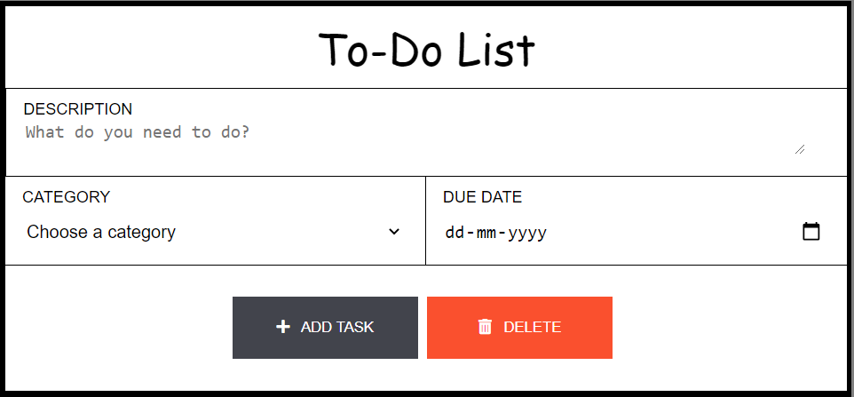

# Todo-List
A dynamic and aesthetic Todo-list website built with HTML, CSS, JS, NodeJS, Express and MongoDB

1. Clone this project
2. Setup mongoDB locally
3. Run node index.js in terminal

**Access TODO-List web page through url: localhost:7000**

